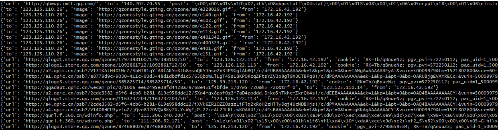

# wifipineaplle_dwall_log
wifipineapple dwall增加log功能

# 加入功能: 

- 原来的DWall版本其实已经很好用了，只是没有记录log，这就让我们不在的时候，没办法看到，所以我加入了记录log的功能.
- 虽然这个功能很简单，但我觉得还是比较实用的，以后只要每次启动就会自动进行记录，错过不了好东西。

# 主要修改的地方：

在运行命令的时候，api/module.php 加入：

        $time = time();
        $date = date("ymdHis",$time);
        $date = $date.".log";

        $this->execBackground("/usr/bin/python /pineapple/modules/DWall/assets/DWall.py > /pineapple/modules/DWall/log/".$date);
    

其实就是把分析的字符串，记录在了文件中,在assets/WebSocketsHandler.py 中加入print，让他打印屏幕。
     
        print dataDict;

## log后内容的格式：

		{'url': 'http://qbwup.imtt.qq.com/', 'to': '140.207.70.55', 'post': '\x00\x00\x01v\x10\x02,<LV\x08qbpcstatf\x04stat}\x00\x01\x01S\x08\x00\x01\x06\x05crypt\x18\x00\x01\x06\nlist<char>\x1d\x00\x01\x015\r\x00\x01\x010\x9a\x07\x9d8\xca&h>\x12\xa4a\xaex\xe2u17\xd4\x85\x159\xd8l2\xc3A6N\xe0D\x802\x88\x8f1z\xd6\xd0\x05\xf7_J"9Y\x12\xb8\xfa\xe5\x84\x90G\tNA\x90x\x0b`&)\xf1\xb7~\x01\x91L\xa3\xa5*r\xe1\xea3\xb9\xaeQ\xfa\xca&\xd5r\xf3X\xc6]\xca\x8a\x9f\x15\xd3\xf0\x15\xc4\'\x00\xa7\xdd\xfc\xa4K\xeb(\x1e\x89\xf1\x1f\x020\x17\xf5\xde\xa0\x96\x11\xec\x92\xa8\xe0q\x13\xf1\xc62\x04!\xea\xd1\x0b)7\xc8\x16V\x89_\x88\x9e^\xa7\xe1`\x17s\xbcib\x9c\xcf\xec\xd8\x19\xb3p79\xbdg\xb5g\xc6\x16/\\\xc9\xb8\xca\xab\x16n\xfd\xc5\xd7GaX\xc0\xdc\xa0\xf1\xe6k\xa9\xb4\r\x8cI8\x14\xe4\xc54|\x03\xf85~\xad\xedj0u5\x12\xe8>\x91\'\xfb\xe8\xd6\xcb\xcc.\x0b\xa8\xdb\x11\xb2\x16\xb5\'\xc27\x17\xe6o\xbd=\xb9\x8a^\x81\x80\xad;,4\x11\xf5\xc7!RMhx\xba\x82g\xa2\xf7\x94U\x896j\x8fd"\xb8>,\x00uC\xf2\xac\xef\xbeQ;fQo\xa7 \xbe\xf9\x96^\xf3\xaa\xd4yC\xd8\xae\n\x14F\xf2}\x86\xf7\x06\xc7-B8uj\xa0\xd7\x1e\x8c\x98\x0c\xa8\x0c', 'from': '172.16.42.192', 'cookie': 'pgv_pvi=990974976; 3g_guest_id=-8811791180292423680'}
		{'to': '123.125.110.26', 'image': 'http://qzonestyle.gtimg.cn/qzone/em/e328029.gif', 'from': '172.16.42.192'}
		{'to': '123.125.110.26', 'image': 'http://qzonestyle.gtimg.cn/qzone/em/e140.gif', 'from': '172.16.42.192'}
		{'to': '123.125.110.26', 'image': 'http://qzonestyle.gtimg.cn/qzone/em/e102.gif', 'from': '172.16.42.192'}
		{'to': '123.125.110.26', 'image': 'http://qzonestyle.gtimg.cn/qzone/em/e122.gif', 'from': '172.16.42.192'}
		{'to': '123.125.110.26', 'image': 'http://qzonestyle.gtimg.cn/qzone/em/e113.gif', 'from': '172.16.42.192'}
		{'to': '123.125.110.26', 'image': 'http://qzonestyle.gtimg.cn/qzone/em/e401342.gif', 'from': '172.16.42.192'}
		{'to': '123.125.110.26', 'image': 'http://qzonestyle.gtimg.cn/qzone/em/e400323.gif', 'from': '172.16.42.192'}
		{'to': '123.125.110.26', 'image': 'http://qzonestyle.gtimg.cn/qzone/em/e401.gif', 'from': '172.16.42.192'}
		{'to': '123.125.110.26', 'image': 'http://qzonestyle.gtimg.cn/qzone/em/e151.gif', 'from': '172.16.42.192'}

# 使用方法:(两种方法) 

## 第一种：

- 在DWall下建立log目录（必须）；
- 覆盖api目录下的modulue.php
- 覆盖assets目录下的UDSHandler.py 

## 第二种：

直接下载我这个版本使用,替换原来的文件即可！
